# Tom And Jerry Survival Adventure

## Project Description

Tom & Jerry Survival Adventure is a casual open-world game developed in Unity using C#.

Players control Jerry and explore an open environment while avoiding Tom, an AI-controlled enemy that continuously chases the player. To survive, players must collect boosters, manage their health, and gather collectibles scattered throughout the world.

Collected rewards can be used to renovate and upgrade Jerry's old room into a luxury room. As the player's level increases, new decorative items and room customization options become available, creating a progression system inspired by room renovation games.

The project combines open-world exploration, enemy AI behavior, collectible systems, player progression, and environment interaction into a fun survival experience.

## Features

✔ Open World Exploration

✔ Third-Person Character Control

✔ AI Enemy Chase System (Tom)

✔ Player Health Bar System

✔ Collectible Item System

✔ Power-Up / Booster System

✔ Survival Gameplay Mechanics

✔ Room Renovation Progression

✔ Player Level System

✔ Unlockable Luxury Room Items

✔ Main Menu Navigation

✔ Unity UI Integration

✔ C# Gameplay Programming

✔ Interactive Game Environment

## Screenshots

### Main Menu
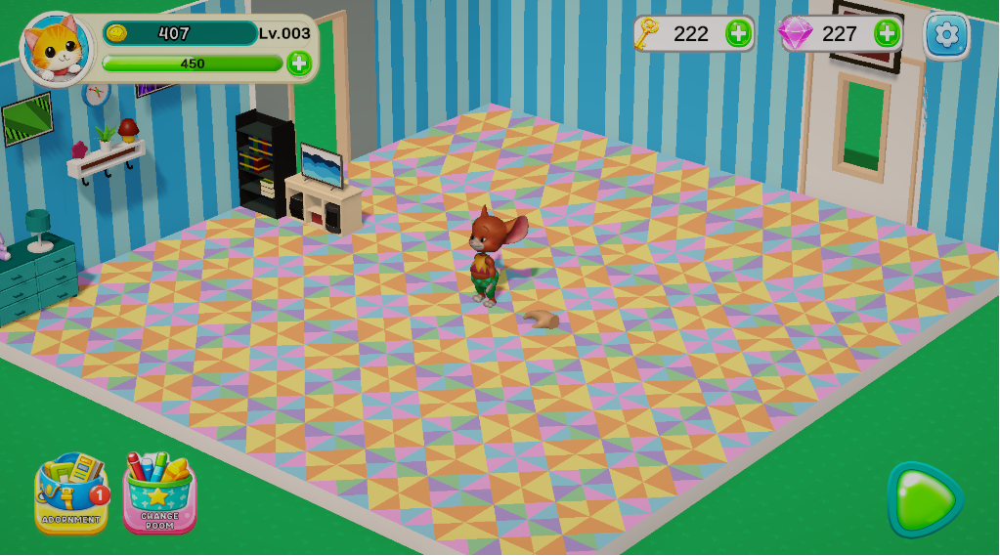

### Loading Screen
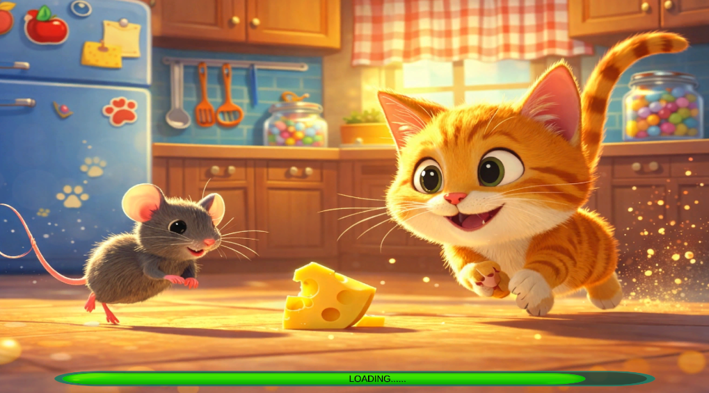

### Kitchen Gameplay
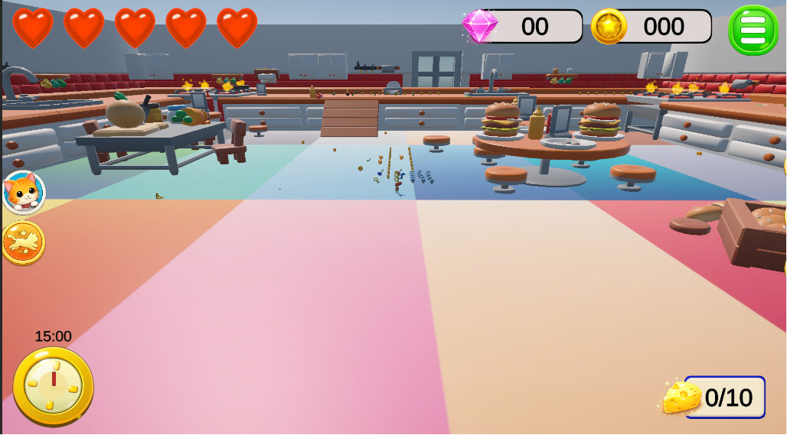

### New Map Gameplay
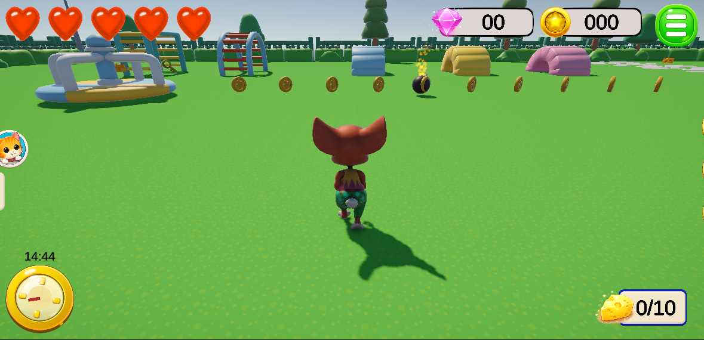

### Playground Gameplay
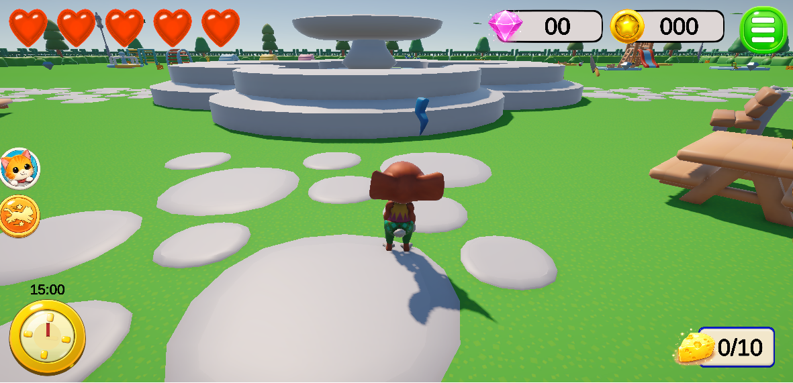

### Playground Survival
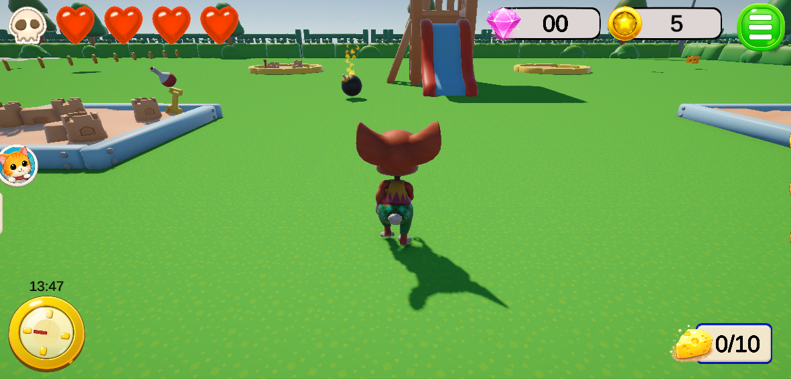

### Third Person Controller
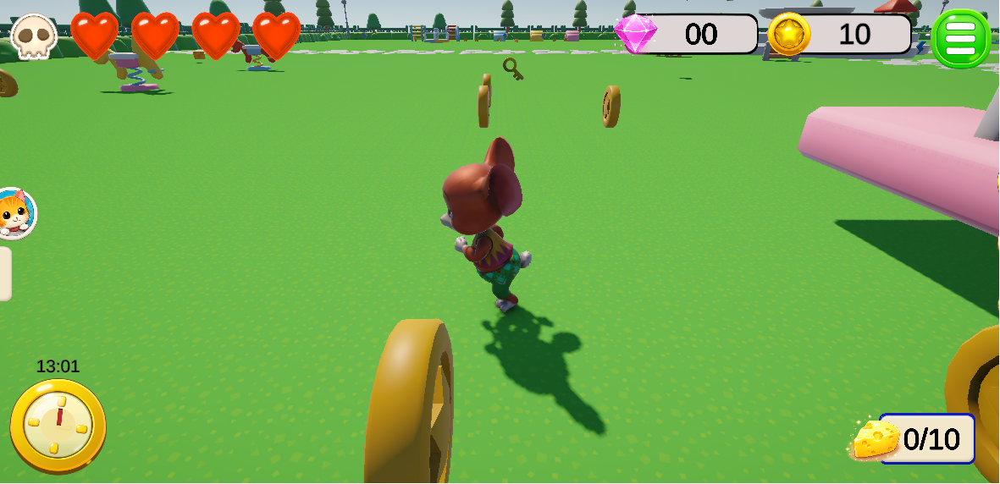

### Collectibles System
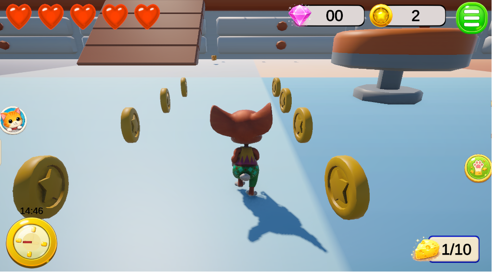

### Advanced Collectibles
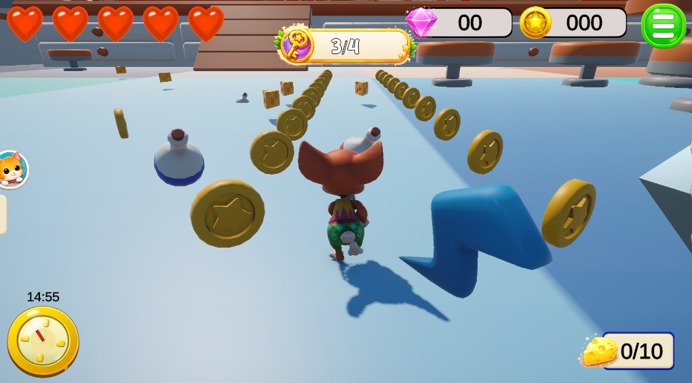

### Room Design System
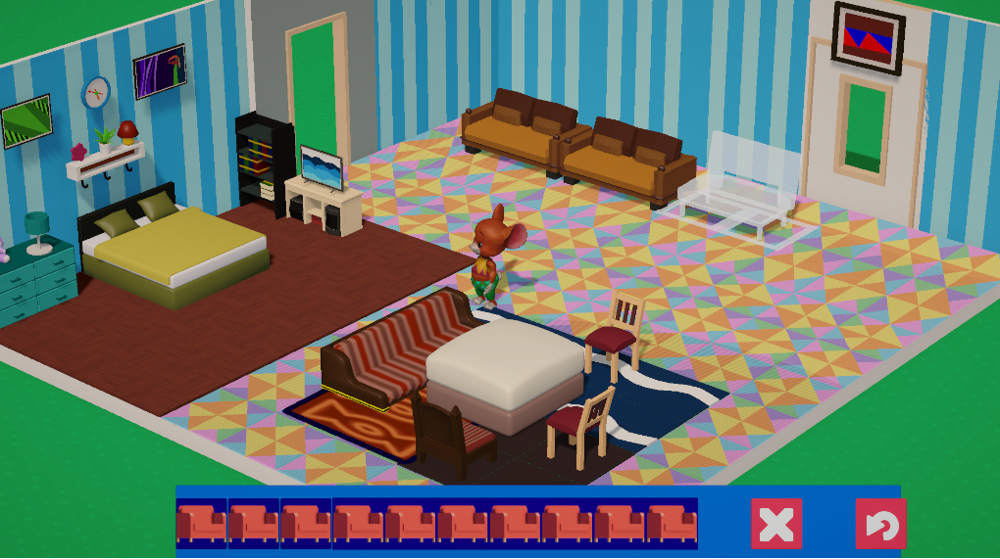

### Cutscene
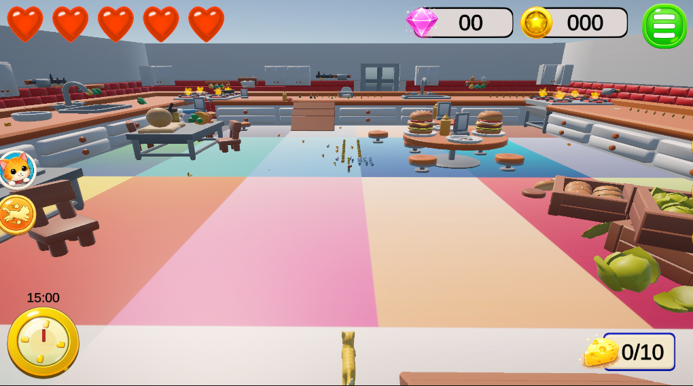

### Lose Popup
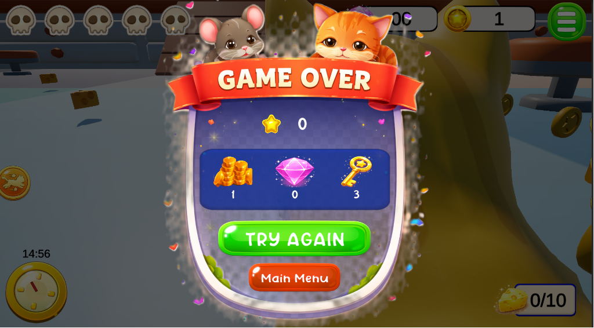
